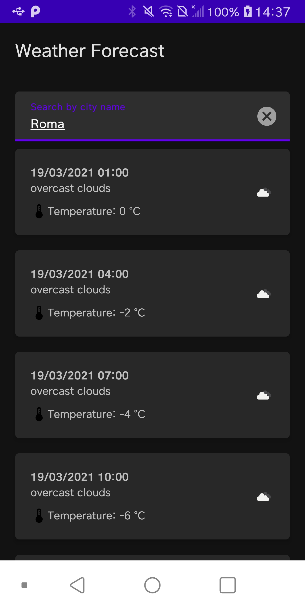

# Weather Forecast - Android Application

Android native application which retrieves weather forecast from Open Weather REST APIs (https://openweathermap.org/api)

Architecture: MVVM
Main components: View Model, Navigation Component (graph), Hilt (dependency injection), Retrofit with coroutine support (API calls), Mockk (unit tests mock)

[Watch the video](https://github.com/andriensis/Weather-Forecast---Android/blob/main/resources/video.mp4?raw=true)
 

  

